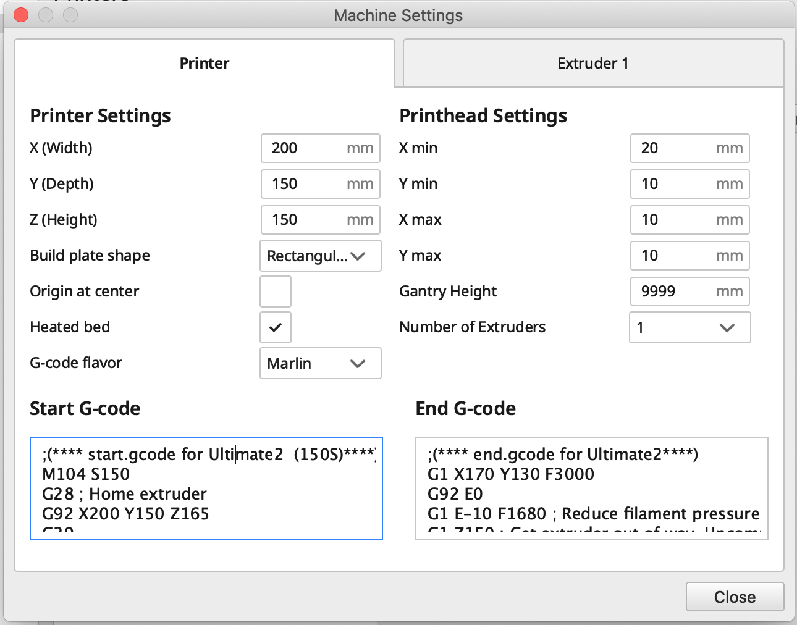
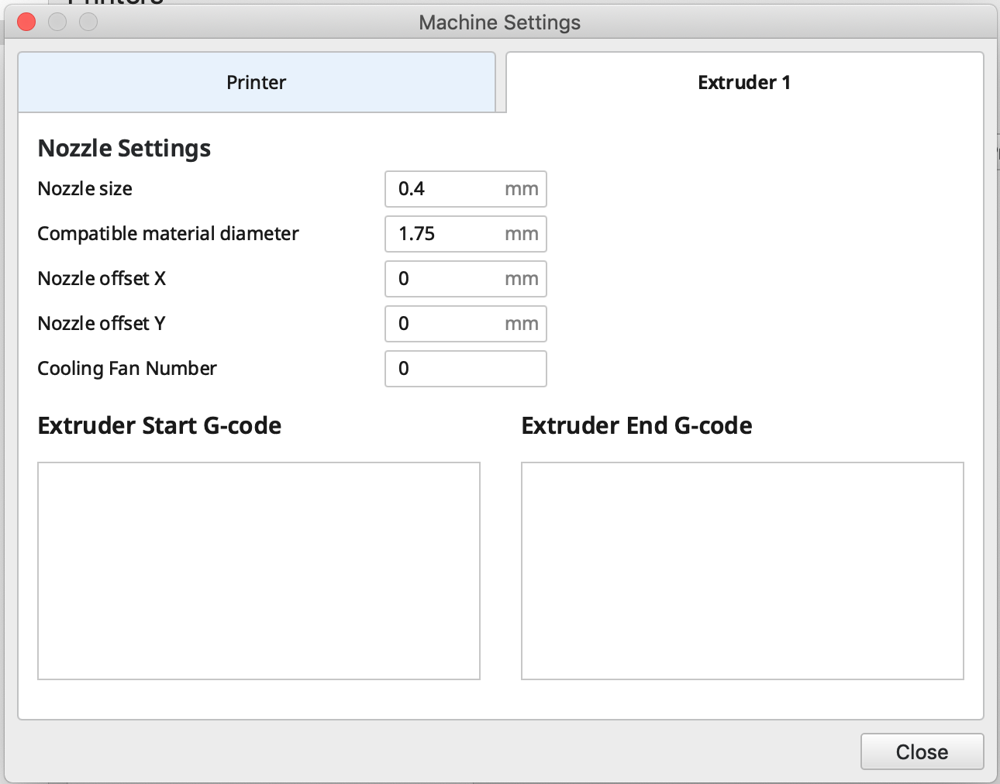

# Monoprice Maker Ultimate 2 Configuration

### Disclaimer
These are the settings that configurations that I've found to work for me so far.  **Use at your own risk.**  I've decided to share them here, because I haven't been able to find much information about these printers online yet.

## Machine Settings for Cura 4.2.1

I took the machine settings from the bundled version of Cura 3.3 and copied them over to Cura 4.2.1 as a Custom FFF Printer.  I had to make a few modifications to the default Start G-code, because it comes shipped with some hardcoded values.  For some reason, the Initial Layer Height is hardcoded at 0.27, which was causing all sorts of first layer issues for me.  My modified Start G-code is available below, and it uses the Initial Layer Height and Printing Temperature Initial Layer settings from your Cura Print Settings instead.

1. In Cura, go to Settings -> Printer -> Add Printer...
2. Add a non-networked printer
3. From the list, select Custom -> Custom FFF printer.
4. Name the printer whatever you'd like.  I chose "Monoprice Maker Ultimate 2".
5. In the "Extruder" tab, add the following:
    * Nozzle size: 0.4
    * Compatible material diameter: 1.75
    * Leave everything else as default.
6. In the "Printer" tab, add the following settings:
    * Printer Settings
        * X (Width): 200
        * Y (Depth): 150
        * Z (Height): 150
        * Build plate shape: Rectangular
        * Origin at center: Unchecked
        * Heated bed: Checked
        * G-code flavor: Marlin
    * Printhead Settings
        * X min: 20
        * Y min: 10
        * X max: 10
        * Y max: 10
        * Gantry Height: 9999
        * Number of Extruders: 1

### Start G-Ccode (modified to remove some hardcoded values)
```
;(**** start.gcode for Ultimate2  (150S)****)
M104 S150
G28 ; Home extruder
G92 X200 Y150 Z165
G29
G1 Z15 F100
M107 ; Turn off fan
G90 ; Absolute positioning
M82 ; Extruder in absolute mode
M109 S{material_print_temperature_layer_0} ;Initial layer temp
G92 E0 ; Reset extruder position
G1 X140 Y7 Z{layer_height_0} F4000
G1 X40 Y7 Z{layer_height_0} E23 F1000
G92 E0
```

### End G-code
```
;(**** end.gcode for Ultimate2****)
G1 X170 Y130 F3000
G92 E0
G1 E-10 F1680 ; Reduce filament pressure
G1 Z150 ; Get extruder out of way. Uncomment to use!
M107 ; Turn off fan
; Disable all extruder
M104 T0 S0
G90 ; Absolute positioning
G92 E0 ; Reset extruder position
M140 S0 ; Disable heated bed
M84 ; Turn steppers off
```





## Basic Print Settings

[Download my custom "Normal" Cura Profile](assets/normal-print-settings.curaprofile)

### Notable Settings
| Setting                  | Value          | Notes |
| -------------------------| -------------- | ----- |
| Layer Height             | 0.15           |       |
| Initial Layer Height     | 0.14           | With the glass bed, I don't think we need a super thick first layer.  I set it to 0.14 based on the information [here](https://3dprinterwiki.info/tips/first-layer-settings/).
| Initial Layer Line Width | 100.0          |       |
| Wall Thickness           | 1.05           | Copied this over from my Monoprice Mini Select V2 settings.  It seems to work well. |
| Wall Line Count          | 3              | After setting the Wall Line Count to 1.05, this value should go up to 3. |
| Enable Retraction        | true           |       |
| Retraction Distance      | 1.2            | Copied from the bundled Cura 3.3 Print Settings |
| Retraction Speed         | 28             | Copied from the bundled Cura 3.3 Print Settings |
| Combing Mode             | Not in Skin    |       |
| Z Hop When Retracted     | false          | I turned this off, because it caused crazy stringing for me. |
